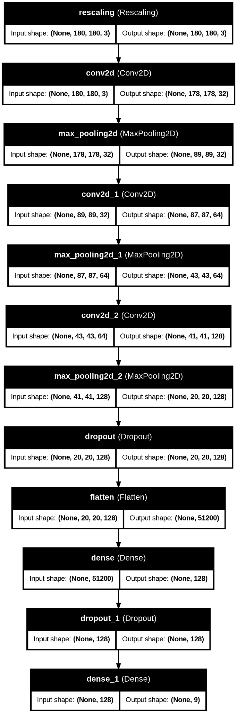

# Project Name
> Outline a brief description of your project.


## Table of Contents
* [General Info](#general-information)
* [Technologies Used](#technologies-used)
* [Conclusions](#conclusions)
* [Acknowledgements](#acknowledgements)

<!-- You can include any other section that is pertinent to your problem -->

## General Information
- Provide general information about your project here.
- What is the background of your project?
- What is the business probem that your project is trying to solve?
- What is the dataset that is being used?

<!-- You don't have to answer all the questions - just the ones relevant to your project. -->

## Conclusions
- Conclusion 1 from the analysis
- Conclusion 2 from the analysis
- Conclusion 3 from the analysis
- Conclusion 4 from the analysis

<!-- You don't have to answer all the questions - just the ones relevant to your project. -->


## Technologies Used
- library - version 1.0
- library - version 2.0
- library - version 3.0

<!-- As the libraries versions keep on changing, it is recommended to mention the version of library used in this project -->

## Acknowledgements
Give credit here.
- This project was inspired by...
- References if any...
- This project was based on [this tutorial](https://www.example.com).


## Contact
Created by [@githubusername] - feel free to contact me!


<!-- Optional -->
<!-- ## License -->
<!-- This project is open source and available under the [... License](). -->

<!-- You don't have to include all sections - just the one's relevant to your project -->


# Melanoma Detection using Custom CNN

## Project Overview
This project builds a **custom Convolutional Neural Network (CNN)** model to classify images of skin cancer into 9 categories, focusing on accurately detecting melanoma, a deadly type of skin cancer. Early detection through automated solutions can aid dermatologists in diagnosis and reduce manual effort.

## Problem Statement
To create a CNN-based model that can evaluate images and accurately detect melanoma and other skin diseases from a dataset of images.

**Dataset**: 
- Sourced from the [International Skin Imaging Collaboration (ISIC)](https://www.isic-archive.com).
- Contains **2,357 images** classified into 9 categories:
   1. Actinic keratosis
   2. Basal cell carcinoma
   3. Dermatofibroma
   4. Melanoma
   5. Nevus
   6. Pigmented benign keratosis
   7. Seborrheic keratosis
   8. Squamous cell carcinoma
   9. Vascular lesion

## Project Pipeline
1. **Data Reading and Understanding**
   - Defined paths for train and test images.
2. **Dataset Creation**
   - Created train and validation datasets with a batch size of 32.
   - Resized images to 180x180.
3. **Dataset Visualization**
   - Visualized one instance of all 9 classes present in the dataset.
4. **Model Building and Training**
   - Built a **custom CNN** with Rescaling, Conv2D, MaxPooling, Dense, and Dropout layers.
   - Used **Adam optimizer** and **categorical cross-entropy loss**.
   - Trained the model for 20 epochs.
   - **Findings**: Model achieved ~92% validation accuracy with slight signs of overfitting.
5. **Data Augmentation**
   - Applied augmentation strategies to address overfitting.
6. **Class Distribution Analysis**
   - Examined class imbalances and identified underrepresented classes.
7. **Handling Class Imbalances**
   - Used **Augmentor library** to balance the dataset by generating additional samples.
8. **Model Training on Augmented Data**
   - Retrained the CNN model on the balanced dataset for 30 epochs.

## Model Training and Findings
### Accuracy and Loss Curves
- **Accuracy**: Training and validation accuracy steadily improved, reaching ~92%.
- **Loss**: Training loss continued decreasing, but validation loss stabilized after epoch 10, indicating slight overfitting.

### Suggestions for Improvement
1. Implement **Early Stopping** to avoid overfitting.
2. Add **Batch Normalization** for faster convergence.

## Technologies Used
- **Python**: 3.9
- **TensorFlow**: 2.12
- **Keras**
- **Augmentor**: For data augmentation
- **Matplotlib**: Data visualization
- **Seaborn**: Class distribution visualization

## Conclusion
This project successfully builds a custom CNN model to classify skin cancer images into 9 classes. By addressing data imbalance and applying data augmentation, the model achieves high accuracy while maintaining generalization.

## Instructions to Run
1. Clone this repository.
2. Install required libraries:
   ```bash
   pip install tensorflow keras matplotlib seaborn augmentor
   ```
3. Run the Jupyter Notebook in a Python environment.

## Acknowledgements
- **Dataset**: [ISIC Archive](https://www.isic-archive.com).
- Project developed as part of the **upGrad & IIITB Machine Learning & AI Program**.

## Contact
Created by **Vaibhav Aggarwal**. Feel free to reach out via email or GitHub for any questions or suggestions.


## Model Architecture
The following diagram shows the architecture of the CNN model:



## Training and Validation Curves
The following plot shows the accuracy and loss curves during training:


